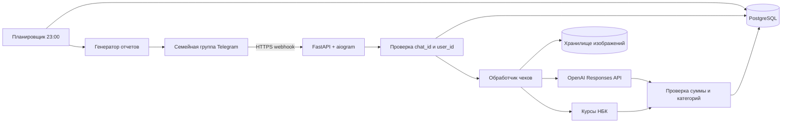

# Архитектура Telegram-бота семейного бюджета

Статус: реализован MVP; production-проверка ещё не выполнена
Дата: 29 августа 2026
Часовой пояс семьи: `Asia/Bangkok`
Базовая валюта учета: `KZT`

## 1. Что строим

Закрытый Telegram-бот для одного семейного группового чата. В группе находятся муж, жена и бот. Пользователи отправляют фотографии чеков или короткие текстовые записи, а система:

1. распознает магазин, дату, валюту, позиции и итог чека;
2. распределяет каждую позицию по бюджетным категориям;
3. пересчитывает расходы в тенге по официальному курсу НБК на дату покупки;
4. сохраняет операцию в постоянной базе данных;
5. показывает короткое подтверждение, чтобы ошибку можно было сразу исправить;
6. ежедневно в 23:00 присылает полный отчет с остатками по категориям;
7. ведет цель «Автомобиль» на 1 200 000 тенге;
8. в конце финансового месяца предлагает перевести неизрасходованный остаток в цель.
9. ежемесячно резервирует 50 000 тенге в фонд бордеррана;
10. принимает чеки и ручные расходы в любой валюте, не ограничиваясь THB.

Бот ведет учет, но не подключается к банку и не переводит реальные деньги. Перевод в накопления считается подтвержденным только после сообщения пользователя, например: `отложил 600000 тенге на машину`.

## 2. Зафиксированные решения

| Решение | Выбор |
|---|---|
| Язык | Python |
| Telegram-фреймворк | `aiogram 3.31.x` |
| Прием сообщений | Telegram webhook по HTTPS |
| HTTP-приложение | FastAPI + Uvicorn |
| База данных | PostgreSQL |
| ORM и миграции | SQLAlchemy 2 + Alembic |
| Распознавание чеков | OpenAI Responses API, изображение + Structured Outputs |
| Основная модель | `gpt-5.6-terra`, настраивается через окружение |
| Расписание | внутренний планировщик с блокировкой в PostgreSQL |
| Отчеты | Telegram HTML + текстовые progress bars; PNG-график по запросу/раз в неделю |
| Развертывание | Docker Compose или тот же Docker-образ в Coolify |
| Первая версия | один экземпляр приложения, без Redis и Celery |

На дату документа актуальная стабильная документация — [aiogram 3.31.0](https://docs.aiogram.dev/en/latest/). Для webhook aiogram поддерживает собственную интеграцию и передачу обновлений в сторонний async-фреймворк. OpenAI Responses API принимает изображения и умеет возвращать JSON по строгой схеме; `gpt-5.6-terra` поддерживает image input и Structured Outputs: [Responses API](https://developers.openai.com/api/reference/cli/resources/responses/methods/create), [модель GPT-5.6 Terra](https://developers.openai.com/api/docs/models/gpt-5.6-terra).

## 3. Семейный бюджет по умолчанию

Категории создаются из шаблона, но не зашиваются навечно в код: лимиты можно менять для следующего финансового месяца.

| Ключ | Категория | Лимит, THB |
|---|---|---:|
| `rent` | Квартира | 13 500 |
| `utilities` | Коммуналка | 3 500 |
| `meat` | Мясо и основной закуп | 5 000 |
| `groceries_household` | Продукты и бытовая химия | 10 000 |
| `seven_eleven` | 7-Eleven | 3 000 |
| `fruit` | Фрукты | 2 000 |
| `training` | Тренировки и такси до них | 7 200 |
| `transport` | Остальное такси | 2 000 |
| `cafe` | Кафе | 3 000 |
| `baby` | Питание и памперсы младенцу | 1 500 |
| `pharmacy` | Аптека | 2 000 |
| `kids` | Одежда и игрушки детям | 1 500 |
| `mobile` | Две SIM-карты | 400 |
| `wife_care` | Ногти и педикюр | 1 000 |
| `haircut` | Стрижка взрослого | 500 |
| `child_haircut` | Стрижка ребенка | 200 |
| `supplements` | Спортивные БАДы | 2 000 |
| `buffer` | Мелкий непредвиденный запас | 1 800 |
|  | **Итого** | **60 100** |

Постоянные параметры:

- обязательные платежи: 200 000 KZT в месяц;
- плановое накопление: 600 000 KZT в месяц;
- цель «Автомобиль»: 1 200 000 KZT;
- фонд бордеррана: 300 000 KZT каждые 6 месяцев, пополнение по 50 000 KZT в месяц;
- отчет: ежедневно в 23:00 по Бангкоку;
- финансовый месяц: с 5-го числа по 4-е число следующего месяца;
- неизрасходованный остаток: предложить добавить к цели при закрытии месяца.

Источники дохода хранятся раздельно, а не одной жестко заданной суммой:

| Источник | Ожидаемая сумма |
|---|---:|
| Казахстанская зарплата №1 | 840 000 KZT |
| Российская зарплата | 660 000 KZT или фактическая сумма/валюта |
| Казахстанская зарплата №2 | 150 000 KZT |
| **Ожидается всего** | **1 650 000 KZT** |

В раннем расчете звучала общая зарплата 1 600 000 KZT, но три названные выплаты дают 1 650 000 KZT. Система не должна полагаться ни на одну из этих цифр: отчет отдельно показывает ожидаемый и фактически полученный доход.

При ориентировочном курсе 14,01 KZT за THB бюджет 60 100 THB равен примерно 842 000 KZT. Если израсходовать все лимиты, распределение `200 000 обязательства + 600 000 автомобиль + 50 000 бордерран + около 842 000 жизнь` превысит доход 1 650 000 KZT примерно на 42 000 KZT. Этот недобор бот показывает в прогнозе накоплений.

Накопление 600 000 KZT является целью, а не выдуманно гарантированным результатом. Бот каждый день считает прогноз:

```text
доступно на автомобиль = фактический доход
                         - обязательства
                         - взнос в фонд бордеррана
                         - фактические расходы
                         - прогноз оставшихся расходов
```

Каждое изменение курса THB на 0,10 KZT меняет тенговую стоимость месячного лимита 60 100 THB на 6 010 KZT. Если прогноз накопления становится ниже 600 000 KZT, вечерний отчет показывает точный ожидаемый недобор.

### 3.1. Общий конверт и подкатегории

Некоторые лимиты являются общими конвертами, но для аналитики расходы внутри них разделяются:

| Общий конверт | Аналитические подкатегории |
|---|---|
| Продукты и бытовая химия | `groceries`, `household` |
| Тренировки и такси до них | `workout`, `training_taxi` |
| Питание и памперсы младенцу | `baby_formula`, `diapers`, `baby_misc` |

Например, бот может сообщить: `Продукты/бытовое: потрачено 4 100 из 10 000 ฿; продукты — 3 100 ฿, бытовое — 1 000 ฿`. Остаток у них общий, потому что отдельный лимит на бытовую химию не задан. Если позже семье понадобятся независимые остатки, подкатегорию можно превратить в отдельный бюджетный конверт без изменения старых операций.

### 3.2. Роли

| Роль | Возможности |
|---|---|
| `owner` | Все операции, изменение лимитов, закрытие месяца, подтверждение накоплений и управление участниками |
| `member` | Добавление чеков/расходов, просмотр отчетов, исправление и отмена семейных операций |
| `system` | Только автоматическое распознавание, курс, отчеты и технические корректировки по заданным правилам |

В MVP один пользователь назначается `owner`, второй — `member`. Любое изменение сохраняет автора по Telegram `user_id`.

## 4. Основной пользовательский сценарий

### 4.1. Фотография чека

1. Пользователь отправляет чек фотографией, документом или альбомом из нескольких фотографий.
2. Webhook проверяет `chat_id` и `user_id`.
3. Бот создает запись чека со статусом `received` и сразу отвечает: `⏳ Чек принят, разбираю`.
4. Фоновый обработчик скачивает изображение максимального доступного качества.
5. Проверяется дубликат по Telegram `file_unique_id`, SHA-256 файла и признакам чека.
6. Изображение передается в OpenAI с перечнем допустимых категорий и строгой JSON-схемой.
7. Сервер проверяет арифметику чека обычным кодом.
8. Загружается и фиксируется официальный курс НБК на дату покупки.
9. Все позиции и финансовая операция записываются одной транзакцией PostgreSQL.
10. Бот присылает короткое подтверждение без длинной сводки:

```text
✅ Big C · 1 240 ฿
🥩 Мясо: 760 ฿
🛒 Продукты/бытовое: 480 ฿
Курс: 14,01 ₸/฿ · Итого: 17 372 ₸

[Верно] [Исправить] [Удалить]
```

Полные остатки не публикуются после каждого чека, чтобы не засорять группу. Они попадают в отчет в 23:00 и доступны по команде `/остаток`.

### 4.2. Почему чек обрабатывается сразу, а не в 23:00

Откладывается только отчет, но не распознавание. Это необходимо, чтобы:

- пользователь сразу заметил неверную сумму или категорию;
- чек не потерялся при перезапуске приложения;
- сбой одного изображения не блокировал все чеки дня;
- вечерний отчет строился только из уже проверенных данных.

### 4.3. Несколько страниц одного чека

Фотографии с одинаковым `media_group_id` собираются в один пакет. Обработчик ждет короткое окно завершения альбома, сортирует страницы по Telegram `message_id` и отправляет их модели как один чек. Итог не должен задваиваться на каждой странице.

### 4.4. Неясный чек

Чек не проводится автоматически, если:

- модель не уверена в валюте или общей сумме;
- сумма строк не сходится с итогом;
- категория одной или нескольких крупных позиций не определена;
- фото размыто или обрезано;
- обнаружен вероятный дубликат.

Такой чек получает статус `needs_review`. Бот показывает только спорные данные и контекстные кнопки категорий. После исправления пользователя правило запоминается для этой семьи: например, исправленный товар `BEEF SLICE` в следующий раз идет в `meat` без повторной догадки.

## 5. Роль OpenAI

OpenAI используется только для извлечения и классификации данных. Модель не имеет прямого доступа к базе и не изменяет баланс самостоятельно.

Пример контракта Structured Output:

```json
{
  "document_type": "receipt",
  "merchant": "Big C",
  "purchased_at": "2026-08-29T18:42:00+07:00",
  "currency": "THB",
  "subtotal": "1240.00",
  "discount": "0.00",
  "tax": "0.00",
  "total": "1240.00",
  "items": [
    {
      "raw_name": "BEEF SLICE",
      "quantity": "1",
      "unit_price": "760.00",
      "line_total": "760.00",
      "category_key": "meat",
      "subcategory_key": null,
      "confidence": 0.97
    }
  ],
  "warnings": [],
  "overall_confidence": 0.96
}
```

Обязательные ограничения:

- модель выбирает `category_key` только из переданного списка;
- модель выбирает `subcategory_key` только из списка, допустимого для выбранного общего конверта;
- неизвестное значение возвращается как `unknown`, без выдумывания;
- цены передаются строками, затем сервер преобразует их в `Decimal`;
- ответ OpenAI вызывается с `store: false`;
- версия модели и версия схемы сохраняются рядом с результатом;
- при плохом результате возможен один повтор с усиленной моделью/качеством изображения, но не бесконечные повторы.

После ответа модели сервер самостоятельно проверяет:

```text
subtotal - discount + tax ≈ total
sum(items.line_total) + unallocated_adjustments ≈ total
```

Допуск: максимум из минимальной практической единицы округления валюты и 0,5% от суммы чека. Для THB это 1 бат. При превышении чек отправляется на проверку человеку.

## 6. Любые валюты и курс НБК

В финансовом ядре нет жесткого списка `THB/KZT/RUB`. Оно принимает положительную сумму и любой трехбуквенный код фиатной валюты ISO 4217. Разговорные названия и обозначения нормализуются, например: `бат/฿ → THB`, `тенге/₸ → KZT`, `донг/₫ → VND`, `рубль/₽ → RUB`.

Символ без однозначного контекста не угадывается. Например, `$` может означать USD, SGD, AUD и другие валюты. В таком случае модель учитывает страну, магазин и код на чеке, а при недостаточной уверенности бот спрашивает пользователя.

Для каждого движения сохраняются одновременно:

- исходная сумма;
- исходная валюта (`THB`, `KZT`, `RUB` и т.д.);
- сумма в KZT;
- дата примененного курса;
- значение курса и номинал;
- источник курса.

Официальный источник — RSS/веб-сервис Национального Банка Казахстана:

- [текущие курсы](https://nationalbank.kz/rss/rates_all.xml);
- [курс на определенную дату](https://nationalbank.kz/ru/page/rss).

Формула с учетом номинала НБК:

```text
amount_kzt = amount_original × rate_kzt / nominal
```

Это особенно важно для вьетнамского донга: НБК публикует VND с номиналом 1 000. Следовательно, чек на 500 000 VND нельзя умножать на опубликованное число напрямую — сначала применяется деление на 1 000.

Если расход сделан во Вьетнаме, но относится к тайскому месячному конверту, выполняются две детерминированные операции по курсам одной даты:

```text
VND → KZT: amount_vnd × vnd_rate_kzt / vnd_nominal
KZT → THB-конверт: amount_kzt × thb_nominal / thb_rate_kzt
```

В базе при этом остаются все три значения: исходные VND, учетные KZT и сумма, на которую уменьшен THB-конверт. Для KZT-чека первый шаг равен 1, но при списании из тайского конверта второй шаг все равно применяется.

Правила:

1. Для чека используется дата покупки на самом чеке.
2. Если дата не читается — дата Telegram-сообщения в `Asia/Bangkok`.
3. Если на выходной нет нового курса — используется последний опубликованный официальный курс, действовавший на эту дату.
4. Курс операции после проведения не меняется молча задним числом.
5. Если НБК временно недоступен, чек сохраняется как `rate_pending`; в отчет он попадает с предупреждением и пересчитывается после восстановления источника.
6. KZT всегда имеет курс 1.
7. Неизрасходованный остаток при закрытии месяца переводится в KZT по официальному курсу даты закрытия; примененный курс фиксируется в проводке переноса.
8. Если валюта отсутствует у НБК, модуль курсов пробует настроенный резервный provider. В проводке явно указывается, что курс не НБК.
9. Если ни один provider не знает валюту, бот спрашивает подтвержденный пользователем курс к KZT. До ответа операция имеет статус `rate_pending` и не уменьшает баланс приблизительным или выдуманным значением.
10. Криптовалюты не считаются фиатными ISO-валютами и при необходимости подключаются отдельным модулем.

Основной итог семьи считается в KZT. При этом тайские категории сохраняют лимиты и остатки в THB, чтобы в магазине было понятно, сколько бат реально можно потратить. Для общего итога каждая операция дополнительно нормализуется в KZT.

## 7. Текстовые сообщения

Большая постоянная клавиатура не нужна. Бот понимает короткие сообщения и имеет несколько аварийных команд.

Примеры:

```text
получена зарплата 840000 тенге
получена российская зарплата 660000 тенге
такси 180 бат
кафе 450 бат
кафе 500000 донгов
отложил 600000 тенге на машину
отложил 50000 тенге на бордерран
перенеси 500 бат из кафе в аптеку
удали последнюю трату
```

Для финансового изменения используется двухступенчатая схема:

1. парсер получает структурированный intent;
2. сервер проверяет пользователя, валюту, категорию, сумму и допустимость операции;
3. только затем сервис создает запись в ledger.

Неоднозначная фраза ничего не списывает и вызывает уточнение.

Минимальные команды:

| Команда | Назначение |
|---|---|
| `/остаток` | Текущие остатки по категориям |
| `/сегодня` | Операции за сегодня |
| `/отчет` | Полный отчет текущего финансового месяца |
| `/график` | PNG-график расходов |
| `/цель` | Прогресс по автомобилю |
| `/доходы` | Ожидаемые и полученные зарплаты |
| `/помощь` | Короткие примеры сообщений |

Inline-кнопки показываются только по контексту: подтвердить чек, исправить категорию, удалить операцию, подтвердить перенос или закрытие месяца.

## 8. Ежедневный отчет в 23:00

Отчет строится по времени `Asia/Bangkok`. Пример:

```text
🌙 Итоги за 29 августа

Сегодня потрачено: 2 340 ฿ · 32 783 ₸
Чеков: 3 · На проверке: 0

Бюджет месяца
🟢 Квартира       [□□□□□□□□□□] 0 / 13 500 ฿
🟡 Мясо           [███████□□□] 3 650 / 5 000 ฿
🟢 Продукты       [████□□□□□□] 4 100 / 10 000 ฿
🟢 7-Eleven       [█□□□□□□□□□] 124 / 3 000 ฿
🔴 Кафе           [█████████□] 2 750 / 3 000 ฿

Всего потрачено: 21 400 / 60 100 ฿
Осталось: 38 700 ฿ · примерно 542 187 ₸

Доход получен: 1 500 000 / 1 650 000 ₸
Обязательства: 200 000 ₸

🚙 Автомобиль
[█████□□□□□] 600 000 / 1 200 000 ₸ · 50%

🛂 Бордерран
[██□□□□□□□□] 50 000 / 300 000 ₸ · до поездки 5 месяцев
```

Цвет определяется долей использованного лимита:

- 🟢 меньше 70%;
- 🟡 от 70% до 90%;
- 🔴 больше 90% или перерасход.

Если за день не было расходов, бот отправляет короткую строку, а не пустой длинный отчет. Если остались чеки `needs_review` или `failed`, они всегда выводятся вверху.

PNG-график не нужен каждый вечер. Он отправляется по `/график` и автоматически раз в неделю: столбцы «лимит / потрачено» по категориям и линия расходов по дням.

## 9. Финансовый месяц и накопление

### Начало месяца

Финансовый период по умолчанию открывается 5-го числа. Первая зарплата после этой даты относится к новому периоду; остальные две выплаты увеличивают `received_income`, но не создают новый месяц повторно.

В отчете одновременно видны:

- ожидаемый доход;
- фактически полученный доход;
- распределено на расходы;
- подтверждено в накопления;
- свободно и пока не распределено.

### Цель «Автомобиль»

У цели есть отдельный ledger. Запланированное накопление и реально подтвержденное накопление — разные значения.

```text
План месяца: 600 000 ₸
Подтверждено переводом: 600 000 ₸
Всего накоплено: 600 000 / 1 200 000 ₸
```

### Фонд бордеррана

Бордерран — не расход одного месяца, а периодический фонд (`sinking fund`):

- плановая стоимость билетов: 300 000 KZT;
- периодичность: раз в 6 месяцев;
- ежемесячное пополнение: 50 000 KZT;
- текущий баланс фонда и дата следующей поездки показываются в отчетах;
- питание, кафе, такси и другие обычные расходы во время поездки продолжают списываться из соответствующих месячных конвертов;
- если билет стоит дороже накопленного фонда, бот не выбирает источник денег сам, а предлагает покрыть разницу из `buffer`, свободного остатка или указанной пользователем категории.

Покупка билета создает расход против фонда бордеррана. Фонд уменьшается, а новый шестимесячный цикл накопления начинается после подтверждения поездки/покупки.

### Закрытие месяца

4-го числа после вечернего отчета бот считает фактический свободный остаток:
все поступления за период минус все проведенные расходы и уже сделанные переводы в
накопления. Затем он присылает предложение:

```text
Фактический свободный остаток: 47 914 ₸.
Куда переложить весь остаток?

[Переложить всё в «Автомобиль»]
[Переложить всё в «MacBook»]
[Оставить остаток резервом]
```

Закрытие можно вызвать командой `/close`, текстом или голосовой фразой `всё, месяц
закончен`. До ответа деньги не считаются накопленными. При подтверждении создается отдельная запись
`goal_contribution`, а не переписываются старые расходы. Закрытый месяц неизменяем; поздняя корректировка
оформляется отдельной корректирующей проводкой с аудитом.

## 10. Компоненты системы



Логические модули приложения:

- `telegram`: webhook, handlers, форматирование и inline-кнопки;
- `receipts`: загрузка, дедупликация, состояния и обработка альбомов;
- `ai`: OpenAI-клиент, prompt/schema versioning и разбор результата;
- `ledger`: расходы, доходы, корректировки и строгая арифметика;
- `budgets`: категории, лимиты, финансовые периоды и переносы;
- `rates`: НБК, кеш и исторические курсы;
- `goals`: накопления, цель автомобиля и фонд бордеррана;
- `reports`: ежедневные сообщения и PNG-графики;
- `jobs`: фоновые задания, повтор ошибок и планирование;
- `admin`: health checks и техническая диагностика.

## 11. Модель данных

Основные таблицы:

| Таблица | Назначение |
|---|---|
| `households` | Семья, Telegram chat, timezone, базовая валюта |
| `members` | Разрешенные Telegram-пользователи и роли |
| `categories` | Названия, ключи, иконки, порядок |
| `subcategories` | Аналитические типы внутри общего бюджетного конверта |
| `budget_cycles` | Финансовые месяцы и статус |
| `budget_allocations` | Лимит категории на конкретный месяц |
| `income_sources` | Три ожидаемых источника зарплаты |
| `ledger_entries` | Доходы, расходы, переносы, корректировки |
| `receipts` | Магазин, итог, статус обработки, Telegram-ссылка |
| `receipt_images` | Страницы чека, хеши, порядок |
| `receipt_items` | Распознанные позиции и категории |
| `exchange_rates` | Дата, ISO-код, номинал, курс к KZT, provider и тип источника |
| `category_aliases` | Запомненные исправления товаров/магазинов |
| `savings_goals` | Цели и периодические фонды, валюта, план, срок и тип |
| `goal_entries` | Подтвержденные пополнения и корректировки |
| `processed_updates` | Защита от повторной обработки Telegram update |
| `audit_log` | Кто, когда и что исправил |
| `scheduled_runs` | Защита от повторной отправки отчета |

Баланс не хранится одним изменяемым числом. Он рассчитывается как сумма неизменяемых проводок ledger. Это позволяет безопасно исправлять операции, восстанавливать историю и проверять расчеты.

Статусы чека:

```text
received → downloading → analyzing → validating → posted
                                      ↘ needs_review
received/downloading/analyzing → failed → retrying
любой этап до posted → duplicate
posted → corrected | reversed
```

## 12. Надежность и защита от ошибок

- уникальность `(chat_id, telegram_message_id)` защищает от повторного webhook;
- `file_unique_id` и SHA-256 защищают от повторно отправленной фотографии;
- сумма, курс и проводки сохраняются в одной транзакции БД;
- деньги хранятся в `Decimal`/целых minor units, никогда не во `float`;
- OpenAI timeout не блокирует Telegram webhook;
- упавшие задания повторяются ограниченное число раз с backoff;
- отчет имеет уникальный ключ `(household_id, date, report_type)` и не отправляется дважды;
- после рестарта приложение подбирает незавершенные чеки и пропущенный отчет;
- ежедневный backup PostgreSQL и хранилища чеков;
- перед обновлением приложения запускаются миграции Alembic и backup.

## 13. Безопасность и приватность

1. Бот принимает финансовые сообщения только из одного разрешенного `chat_id`.
2. Запись разрешена только двум известным Telegram `user_id`.
3. Telegram webhook проверяет `X-Telegram-Bot-Api-Secret-Token`.
4. Bot token, OpenAI API key, database URL и backup credentials находятся только в переменных окружения хостинга.
5. Секреты нельзя присылать в группу, сохранять в Git или в браузерный frontend.
6. OpenAI получает только изображение чека и инструкцию извлечения, без истории семейного бюджета.
7. Изображения чеков хранятся в закрытом volume/object storage; срок хранения настраивается, например 90 дней.
8. Логи не содержат токены, полные изображения или свободный текст чеков.
9. Все исправления и удаления оставляют audit trail.

Чтобы бот видел обычные фотографии в группе, нужно отключить Group Privacy в BotFather и после изменения заново добавить бота в группу либо сделать бота администратором. Предпочтительно отключить privacy и не выдавать лишние административные права. Telegram по умолчанию ограничивает сообщения, доступные групповому боту: [Telegram Privacy Mode](https://core.telegram.org/bots/features#privacy-mode).

## 14. Развертывание

MVP состоит из двух обязательных контейнеров:

```text
app       FastAPI + aiogram + receipt worker + scheduler
postgres  постоянная база данных
```

Дополнительно:

```text
backup    ежедневный зашифрованный backup
storage   volume или S3-compatible bucket для чеков
```

Требования к серверу:

- публичный домен с HTTPS для Telegram webhook;
- постоянный PostgreSQL volume;
- постоянное хранилище изображений;
- исходящие HTTPS-соединения к Telegram, OpenAI и НБК;
- фиксированный `TZ=Asia/Bangkok` только для отображения, все даты в БД — UTC;
- один экземпляр scheduler либо PostgreSQL advisory lock.

Технические endpoints:

- `GET /health/live` — процесс работает;
- `GET /health/ready` — доступна БД и применены миграции;
- `POST /telegram/webhook` — Telegram update;
- никаких публичных endpoints с семейными данными в MVP.

## 15. Этапы реализации

### Этап 1. Надежный финансовый фундамент

- проект, Docker и PostgreSQL;
- Telegram webhook и allowlist;
- категории и финансовый месяц;
- ручные расходы/доходы текстом;
- курс НБК;
- `/остаток`, `/сегодня`, `/доходы`;
- ежедневный отчет в 23:00.

### Этап 2. Чеки

- фото, документы и альбомы;
- OpenAI Structured Outputs;
- распределение строк по категориям;
- проверка арифметики;
- дубликаты, подтверждение, исправление и удаление;
- обучение на семейных исправлениях.

### Этап 3. Накопления и визуализация

- цель «Автомобиль»;
- шестимесячный фонд бордеррана;
- плановые и подтвержденные пополнения;
- закрытие месяца и перенос остатка;
- progress bars и PNG-график;
- прогноз до конца месяца.

### Этап 4. Production

- backup/restore test;
- мониторинг ошибок;
- ограничение расходов OpenAI;
- проверка перезапуска и повторных webhook;
- тестовое закрытие месяца;
- безопасное развертывание на предоставленном хостинге.

## 16. Критерии готовности MVP

MVP считается готовым, когда доказано следующее:

1. Оба разрешенных пользователя отправляют чеки в одну группу.
2. Один смешанный чек корректно делится минимум на две категории.
3. THB, VND, KZT и RUB сохраняются в исходной валюте и корректно нормализуются в KZT; номинал 1 000 для VND обрабатывается правильно.
4. Повторная отправка того же чека не списывает деньги второй раз.
5. Неверно распознанную позицию можно исправить без ручной работы с БД.
6. Перезапуск контейнера не теряет чек и не дублирует расход.
7. В 23:00 приходит один отчет с остатками и проблемными чеками.
8. Три зарплаты отражаются раздельно и суммируются по факту.
9. Цель автомобиля показывает только подтвержденные накопления.
10. Фонд бордеррана ежемесячно получает 50 000 KZT и отдельно показывает остаток до 300 000 KZT.
11. Закрытие месяца переносит остаток отдельной проводкой и сохраняет историю.
12. Backup успешно восстанавливается в чистую PostgreSQL.
13. Production health, webhook и отчет проверены после реального deployment.
14. Неизвестная НБК валюта не проводится по выдуманному курсу: используется настроенный fallback либо запрашивается ручное подтверждение.

## 17. Рабочие допущения перед кодом

- российская зарплата пока задана эквивалентом 660 000 KZT; фактическую валюту и фактическую сумму нужно подтвердить;
- 600 THB на тренировку уже включает 300 THB тренировки и 300 THB такси;
- дополнительные 2 000 THB транспорта не включают поездки на тренировку;
- бытовая химия включена в лимит 10 000 THB;
- фрукты ограничены месячным конвертом 2 000 THB, даже если календарное среднее четырех с третью недель чуть выше;
- фонд бордеррана покрывает 300 000 KZT на билеты раз в полгода; остальные расходы поездки идут по обычным категориям;
- первый автомобильный период начинается с нуля, если пользователь не укажет уже накопленную сумму.
